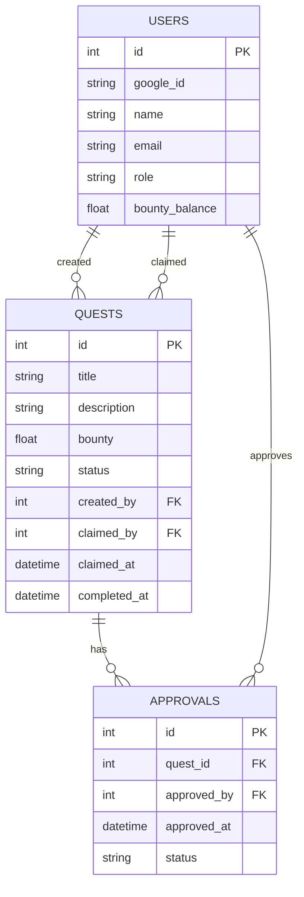

# Chore-Management Website: Architecture Document

- [Chore-Management Website: Architecture Document](#chore-management-website-architecture-document)
  - [Overview](#overview)
  - [1. System Components](#1-system-components)
    - [1.1. Web Frontend](#11-web-frontend)
    - [1.2. Backend API](#12-backend-api)
    - [1.3. Database](#13-database)
  - [2. Authentication \& Authorization](#2-authentication--authorization)
    - [2.1. Google OAuth2](#21-google-oauth2)
    - [2.2. Role-Based Access Control (RBAC)](#22-role-based-access-control-rbac)
  - [3. Core Features \& Workflows](#3-core-features--workflows)
    - [3.1. Quest Board](#31-quest-board)
    - [3.2. Quest Lifecycle](#32-quest-lifecycle)
    - [3.3. User Dashboard](#33-user-dashboard)
  - [4. Data Model (ER Diagram)](#4-data-model-er-diagram)
  - [5. API Endpoints (Sample)](#5-api-endpoints-sample)
  - [6. Scheduled Jobs](#6-scheduled-jobs)
  - [7. Security \& Best Practices](#7-security--best-practices)
  - [8. Deployment](#8-deployment)
  - [9. Future Enhancements](#9-future-enhancements)

## Overview

This document outlines the architecture for a chore-management website that
gamifies household or team chores as "quests" with bounties. The system supports
role-based access control (RBAC), Google OAuth2 authentication, and a clear
workflow for claiming, completing, and approving quests.

---

## 1. System Components

### 1.1. Web Frontend

- **Framework:** React (or Vue/Angular)
- **Responsibilities:**
  - User authentication via Google OAuth2
  - Display quest boards and dashboards
  - Allow users to claim, complete, and view quests
  - Admin/editor interfaces for quest management and approvals

### 1.2. Backend API

- **Framework:** FastAPI (Python), Express (Node.js), or similar
- **Responsibilities:**
  - Handle authentication and session management
  - Enforce RBAC and business logic
  - Manage quest lifecycle and user actions
  - Serve data to frontend via REST or GraphQL
  - Scheduled job for quest claim expiry

### 1.3. Database

- **Type:** SQLite (for simplicity and local development)
- **Entities:**
  - Users
  - Quests
  - Claims
  - Bounties
  - Approvals

---

## 2. Authentication & Authorization

### 2.1. Google OAuth2

- Users authenticate via Google OAuth2.
- On first login, a user record is created in the database.
- Session tokens (JWT or similar) are issued for authenticated requests.

### 2.2. Role-Based Access Control (RBAC)

- **Roles:**
  - **Admin:** Full access, can manage users, quests, and approve completions.
  - **Editor:** Can create/edit quests, approve completions.
  - **Player Character:** Can view/claim/complete quests, but only edit their
    own claims.
- **Enforcement:** Middleware checks user role for each protected endpoint.

---

## 3. Core Features & Workflows

### 3.1. Quest Board

- **View:** All authenticated users see available quests and who has claimed
  others.
- **Claim:** Any user can claim an unclaimed quest. The quest is locked for 48
  hours.
- **Claim Expiry:** If no action is taken within 48 hours, the quest returns to
  the pool (handled by a scheduled backend job).

### 3.2. Quest Lifecycle

1. **Creation:** Admin/editor creates a quest.
2. **Claim:** Player claims a quest (quest is locked to them for 48h).
3. **Completion:** Player marks quest as completed.
4. **Approval:** Admin/editor reviews and approves/rejects completion.
5. **Bounty Award:** Upon approval, bounty is credited to the player.

### 3.3. User Dashboard

- Shows:
  - Number of completed quests
  - Total bounty accumulated
  - Current claimed quests and their status

---

## 4. Data Model (ER Diagram)

---

## 5. API Endpoints (Sample)

- `POST /auth/google` — Google OAuth2 login
- `GET /quests` — List all quests
- `POST /quests` — Create quest (admin/editor)
- `PUT /quests/:id/claim` — Claim quest (player)
- `PUT /quests/:id/complete` — Mark as completed (player)
- `PUT /quests/:id/approve` — Approve completion (admin/editor)
- `GET /dashboard` — User dashboard

---

## 6. Scheduled Jobs

- **Quest Claim Expiry:** Runs every hour, checks for quests claimed >48h ago
  with no completion, and returns them to the pool.

---

## 7. Security & Best Practices

- All endpoints require authentication.
- RBAC enforced at API level.
- Input validation and sanitization.
- Use HTTPS in production.
- Store only minimal user info from Google.

---

## 8. Deployment

- **Backend:** Containerized (Docker), can run locally or on cloud.
- **Frontend:** Static hosting (Vercel, Netlify, etc.)
- **Database:** SQLite file, with option to migrate to PostgreSQL/MySQL for
  production.

---

## 9. Future Enhancements

- Email notifications for quest status changes.
- Leaderboards and gamification.
- Mobile app support.
- Integration with payment systems for real-world bounties.
